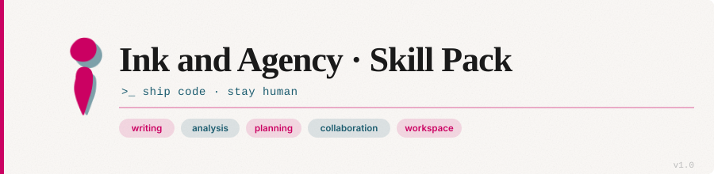
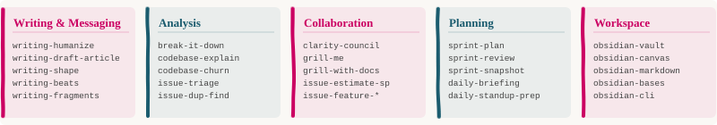

# Ink and Agency Skill Pack

An opinionated library of reusable prompt skills for Claude and compatible agents.

The pack is built to work well with Claude-compatible skill loading, but most of the content is deliberately plain Markdown and easy to adapt to other prompt-driven agents. Each folder is a self-contained skill, so you can browse the pack like a catalog instead of reading a giant manual.

**Part of the Ink and Agency ecosystem:** a single skills library spanning quick workflow techniques and deep domain specialists (see [INTEGRATION.md](INTEGRATION.md)).



## What’s in the pack

- Practical skills for writing, planning, triage, architecture, and workspace workflows
- One `SKILL.md` entry point per skill folder
- Supporting docs where a skill needs examples, formats, or deeper guidance
- A structure that works directly with Claude and can usually be adapted to other agents with light changes

## Skill Map

| Area | Example skills | What they help with |
| --- | --- | --- |
| Writing & messaging | `writing-humanize`, `writing-tone-check`, `writing-apology-calibrator`, `writing-social-script` | Composing long-form text, calibrating outgoing messages, scripting awkward conversations |
| Analysis | `break-it-down`, `codebase-explain`, `issue-triage` | Making sense of a codebase, decoding incoming messages, diagnosing bugs faster |
| Collaboration | `clarity-council`, `grill-me`, `grill-with-docs` | Getting sharper decisions through structured discussion |
| Planning | `sprint-plan`, `sprint-review`, `daily-briefing`, `handoff` | Organizing work, progress, reporting, and context continuity |
| Focus & state | `task-initiation`, `hyperfocus-recovery`, `idea-decision-maker`, `energy-budget`, `meeting-decompression` | Defeating stalls, recovering context, calibrating load — built with ND-friendly defaults |
| Git & workflow | `branch-rebase`, `branch-resolve-conflicts` | Clean rebases with trivial conflict auto-resolution, complex conflict resolution with intent preservation |
| Workspace tools | `obsidian-vault`, `obsidian-markdown`, `obsidian-canvas` | Managing notes, structure, and visual knowledge maps |



## Quick Start

For Claude, clone this repository into your skills directory:

```bash
git clone git@github.com:risadams/skills.git "$HOME/.claude/skills"
```

That’s it. Once the repo is in place, Claude can discover the skills directly from the folder structure.

If you are using another agent, the same folder layout is still useful, but the install location and invocation rules may differ.

## Check the install

After cloning, you should see paths like these:

- `$HOME/.claude/skills/writing-humanize/SKILL.md`
- `$HOME/.claude/skills/clarity-council/SKILL.md`
- `$HOME/.claude/skills/codebase-explain/SKILL.md`

## Using skills

There is no separate run command.

In Claude, skills are triggered in chat by asking for the behavior you want. A few examples:

- Use `writing-humanize` on this paragraph.
- Use `codebase-explain` for this module.
- Triage `PROJ-1234`.
- Run a `clarity-council` on this design.

In other agents, the same prompts often still work, but you may need to wire the skill files into that agent's own prompt, skill, or tool-loading system.

## How skills compose

This pack is **skills-only** — one primitive covering both quick workflow techniques and deep domain
specialists (the latter, like `backend-developer` and `security-auditor`, were formerly subagents; see
[ADR-0006](../docs/adr/ADR-0006-agents-folded-into-skills.md)).

### Two kinds of skill

| | Workflow skill | Specialist skill |
| --- | --- | --- |
| **Shape** | A triggered procedure | A persona expert |
| **Examples** | `code-review`, `writing-humanize`, `sprint-plan` | `backend-developer`, `security-auditor`, `python-pro` |
| **Use when** | You want a structured technique | You want domain judgment |

### Common patterns

**Pattern 1: workflow skill invokes a specialist**

```text
implement skill
  → writes the API
  → code-review skill → validated diff
```

**Pattern 2: a flow chains skills**

```text
grill → work-plan → plan-to-spec → plan-to-tickets → implement (tdd + code-review)
```

Skills declare workflow neighbours in the `related-skills` frontmatter field. For the full model, see
**[INTEGRATION.md](INTEGRATION.md)**; for named end-to-end flows, see **[FLOWS.md](FLOWS.md)**.

---

## Compatibility

This pack is Claude-compatible first, but it is not Claude-only.

Most skills in this repo are prompt assets with a stable folder structure, so they usually port cleanly to other agents. In practice, you may need to adjust:

- Install location, because other agents may not read from `.claude/skills`
- Frontmatter fields, if another agent expects different metadata keys
- Tool names or allowed-tool lists, if the target agent exposes a different tool model
- Invocation patterns, if the target agent uses commands, slash prompts, or manifests instead of folder discovery

If an agent can read Markdown prompt files and route on instructions, the content itself usually needs little or no rewriting. The main work is usually integration, not rewriting the skill.

## Browse the catalog

The full inventory lives in **[CLAUDE.md](CLAUDE.md#skills-inventory)**. That file is the source of truth for the skill list and descriptions, which keeps this README short and prevents drift.

## Release notes

- **v1.2** (2026-06-17)
  - **Communication & interpretation**: `break-it-down` (helps neuro-divergent minds decode messages and intent)
  - **Code analysis & understanding**: `codebase-explain`, `codebase-improve-architecture`, `codebase-churn`, `codebase-plan-refactor`, `issue-triage`, `issue-dup-find`, `issue-estimate-sp`, `issue-feature-breakdown`, `issue-suggest-component`
  - **Collaboration & decisions**: `clarity-council`, `grill-me`, `grill-with-docs`, `idea-generate`, `idea-choice`, `idea-decision-maker`
  - **Git & merge workflows**: `branch-rebase`, `branch-resolve-conflicts` (now with full intent preservation for complex conflicts)
  - **Planning & reporting**: `sprint-plan`, `sprint-review`, `sprint-snapshot`, `sprint-sos-report`, `daily-briefing`, `daily-standup-prep`, `good-morning`
  - **Writing workflows**: `writing-draft-article`, `writing-shape`, `writing-fragments`, `writing-beats`, `writing-cold-open`, `writing-humanize`, `writing-tone-check`, `writing-apology-calibrator`, `writing-social-script`, `writing-rejection-sensitivity-check`
  - **Workspace & knowledge**: `obsidian-vault`, `obsidian-markdown`, `obsidian-canvas`, `obsidian-charts`, `obsidian-bases`, `obsidian-cli`, `defuddle`
  - **Utilities**: `hyperfocus-recovery`, `task-initiation`, `time-reality-check`, `energy-budget`, `interest-capture`, `meeting-decompression`, `rejection-sensitivity-check`, `handoff`, `skill-create`
  - Updated **Skills + Agents** section with integration patterns and related-agents field documentation
- **v1.1** (2026-05-19)
  - New `writing-*` siblings for outgoing messages: `writing-tone-check`, `writing-apology-calibrator`, `writing-rejection-sensitivity-check`, `writing-social-script`, `writing-cold-open`
  - New **Focus & state** skills: `task-initiation`, `hyperfocus-recovery`, `time-reality-check`, `idea-decision-maker` (renamed from `decision-breaker`), `energy-budget`, `interest-capture`, `meeting-decompression`
- **v1.0** (2026-05-18)
  - Initial public release of the skills pack

## Contributing notes

This is an unsupported personal project. Fork freely, but no PRs are accepted.

For project conventions, naming schemes, and layout rules, see **[CONTRIBUTING.md](CONTRIBUTING.md)**.
